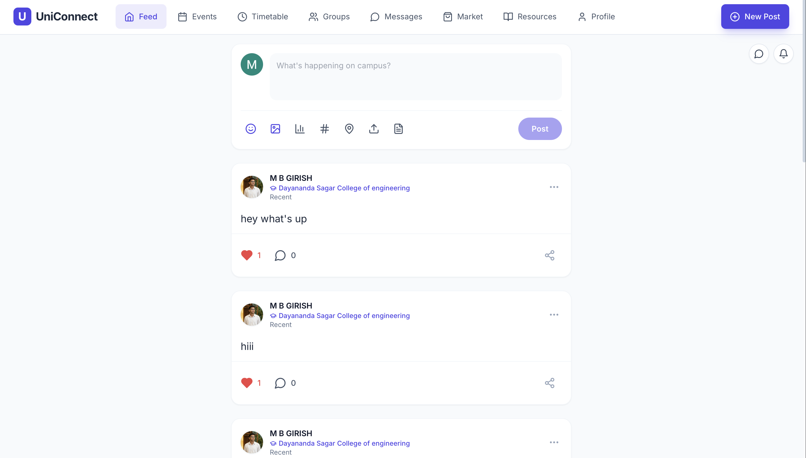
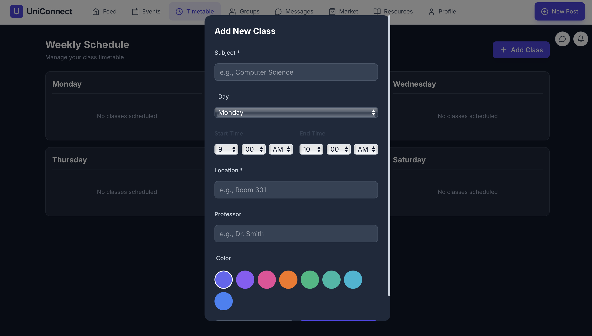
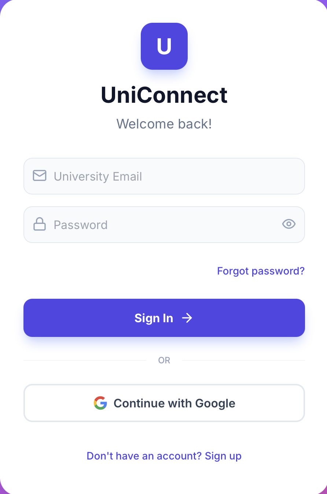

# UniConnect

## Problem Statement

University campuses operate as fragmented ecosystems where students rely on multiple disconnected channels for communication, collaboration, and resource sharing. Common challenges include:

- No centralized platform for campus-wide announcements and social interaction
- Difficulty finding study groups and academic collaborators
- Fragmented event discovery across email, bulletin boards, and social media
- Limited peer-to-peer marketplace for textbooks and supplies
- Inefficient class schedule management and reminder systems
- Lack of real-time messaging infrastructure for student networks

This fragmentation leads to missed opportunities, reduced engagement, and operational inefficiencies. Success is measured by user adoption, daily active usage, and the platform's ability to replace multiple existing tools with a single integrated solution.

## Objective

Build a unified campus communication and collaboration platform that consolidates social networking, event management, study group coordination, marketplace transactions, and academic scheduling into a single web application. The system must support real-time interactions, scale to thousands of concurrent users, and maintain data security and user privacy.

Constraints: Must operate within Firebase free tier limits during initial deployment, support web platforms with responsive design, and maintain sub-second response times for core interactions.

## Users & Use Cases

**Target Users**: University students, faculty members, and campus administrators.

**Core User Workflows**:

1. **Social Engagement**: Students create and consume posts, comment on discussions, and build campus connections through profile discovery
2. **Event Management**: Organizers create events with RSVP tracking; attendees discover and register for campus activities
3. **Study Collaboration**: Students form public or private study groups, share resources, and coordinate group discussions
4. **Marketplace Transactions**: Buyers and sellers list items, negotiate inquiries, and complete peer-to-peer transactions
5. **Academic Scheduling**: Students manage class timetables and receive automated reminders before class start times
6. **Real-Time Messaging**: One-to-one and group chat with media sharing, location sharing, and read receipts
7. **Resource Sharing**: Centralized repository for course materials, lecture notes, and academic resources

**Key Actions**: Post creation, event RSVP, group membership management, marketplace listing creation, direct messaging, timetable management, notification consumption.

## System Architecture

**High-Level Architecture**:

- **Frontend**: React 18 SPA with TypeScript, client-side routing via React Router, responsive UI built with TailwindCSS
- **Backend**: Firebase Firestore for document storage, Firebase Authentication for user management
- **Real-Time Layer**: Firestore `onSnapshot` listeners for live updates across messaging, notifications, and feed
- **Media Storage**: Cloudinary for image and file uploads with CDN delivery

**Communication Patterns**:

- Client-side application communicates directly with Firebase services via SDK
- Real-time subscriptions use Firestore listeners with automatic reconnection
- Media uploads route through Cloudinary API before storing URLs in Firestore
- Authentication state managed via Firebase Auth with session persistence

**Authentication and Authorization**:

- Firebase Authentication handles user sign-in (email/password, Google OAuth)
- Firestore Security Rules enforce data access at the database level
- User context propagated through React Context API
- Protected routes require authenticated sessions
- Role-based permissions for group ownership and administration

## Technology Stack

**Frontend**:
- React 18.2.0 with TypeScript 5.8.2
- React Router DOM 6.22.3 (HashRouter for deployment compatibility)
- TailwindCSS for utility-first styling
- Lucide React for iconography
- Vite 6.2.0 as build tool and dev server

**Backend**:
- Firebase Firestore 10.8.0 for document database
- Firebase Authentication for user management
- Cloudinary for media storage and transformation

**Additional Services**:
- Google Generative AI SDK for AI-powered features (optional)
- EmailJS for email notifications
- OpenStreetMap Nominatim API for reverse geocoding

**Infrastructure**:
- Firebase Hosting for web deployment
- Vercel/Netlify compatible for alternative hosting
- Firebase Cloud Functions (future enhancement)

## Core Features

1. **Authentication System**: Email/password registration, Google Sign-In, password reset via email, session management, onboarding flow for new users

2. **Social Feed**: Post creation with multiple image attachments, like and comment interactions, real-time updates via Firestore listeners, infinite scroll pagination, post editing and deletion

3. **Event Management**: Event creation with cover images, RSVP system (Going/Interested/Not Going), capacity management, attendee lists, category filtering, event editing and deletion by hosts

4. **Study Groups**: Public and private group creation, instant join for public groups, approval workflow for private groups, group-specific messaging with media support, role-based permissions (owner, admin, member), member management

5. **Marketplace**: Item listings with multiple images, search and filter by category/price/condition, inquiry system for buyer-seller communication, sold status management, listing editing and deletion

6. **Direct Messaging**: One-to-one conversations with real-time message delivery, group chat support, text, image, file, and location sharing, emoji picker integration, read receipts and unread counts, upload progress indicators

7. **Timetable Management**: Class schedule creation and editing, day-based organization, automated reminders 5-10 minutes before class start, ongoing class indicators, color-coded visual organization

8. **Resource Sharing**: Course material uploads, module-based organization, search and filter capabilities, download functionality

9. **Notifications**: In-app notification center, real-time delivery via Firestore, unread count badges, notification types for comments, likes, group invites, event updates, marketplace inquiries, class reminders

10. **User Profiles**: Profile creation and editing, avatar uploads, bio and contact information, social media links, public profile viewing, profile sharing via Web Share API

## Data & Storage

**Type of Data Stored**:

- User profiles (display name, email, bio, avatar URL, college affiliation)
- Posts (text content, image URLs, author ID, timestamps, like/comment counts)
- Events (title, description, date/time, location, cover image, RSVP data, capacity)
- Study groups (name, description, privacy settings, member list, role assignments)
- Marketplace listings (title, description, price, images, condition, seller ID, status)
- Direct messages (text, media URLs, sender/receiver IDs, timestamps, read status)
- Group messages (text, media URLs, sender ID, group ID, timestamps)
- Conversations (participant IDs, last message metadata, unread counts)
- Notifications (type, message, link, read status, timestamps)
- Timetable entries (subject, day, start/end time, location, professor, color)
- Resources (title, file URL, module number, uploader ID, timestamps)

**Schema Design**:

- Collections organized by entity type (users, posts, events, groups, marketplace, conversations)
- Subcollections for related data (users/{userId}/notifications, groups/{groupId}/messages, conversations/{id}/messages)
- Denormalized data for performance (last message in conversation summary, unread counts)
- Timestamp fields using Firestore `serverTimestamp()` for consistency
- Indexed fields for common queries (userId, createdAt, participants array)

**Performance Considerations**:

- Client-side sorting for conversation lists to avoid composite index requirements
- Pagination limits (300 messages per conversation, 50 notifications per user)
- Image optimization via Cloudinary transformations
- Lazy loading for feed content with infinite scroll
- Real-time listener cleanup to prevent memory leaks

## API Design

**API Style**: Direct Firebase SDK calls from client, no custom REST API layer.

**Key Operations**:

- Authentication: `signInWithEmailAndPassword`, `createUserWithEmailAndPassword`, `signInWithPopup`, `sendPasswordResetEmail`
- Firestore Queries: `collection()`, `doc()`, `query()`, `where()`, `orderBy()`, `limit()`, `onSnapshot()`
- Real-Time Subscriptions: `onSnapshot` for messages, notifications, feed updates
- Document Operations: `addDoc()`, `updateDoc()`, `deleteDoc()`, `getDoc()`, `setDoc()`
- Media Upload: Cloudinary upload API with progress tracking

**Validation and Error Handling**:

- Input validation at component level (required fields, email format, file size limits)
- Firestore Security Rules enforce data integrity at database level
- Try-catch blocks around async operations with user-facing error messages
- Graceful degradation when services unavailable (demo data, disabled features)
- Error boundaries for React component failures

## Security Considerations

**Auth Model**:

- Firebase Authentication manages user sessions and token refresh
- Protected routes require authenticated user context
- Password reset via secure email links with action code verification
- Google OAuth for third-party authentication

**Data Protection**:

- Firestore Security Rules restrict read/write access based on authentication and ownership
- Users can only modify their own profiles, posts, and listings
- Group permissions enforced via role checks in security rules
- Private groups restrict message access to members only
- Notification subcollections are user-private

**Input Validation**:

- File type validation (images: JPG, PNG, WEBP; files: PDF, DOCX, etc.)
- File size limits (images: 10MB, files: 20MB)
- Text input sanitization to prevent XSS
- Email format validation
- URL validation for external links

## Testing Strategy

**Types of Tests**: Manual testing for user workflows, browser compatibility testing, responsive design testing across devices.

**Tools Used**: Browser DevTools for debugging, Firebase Console for data inspection, React DevTools for component debugging.

**Coverage Scope**:

- Authentication flows (sign up, sign in, password reset, Google OAuth)
- CRUD operations for all entity types (posts, events, groups, marketplace, messages)
- Real-time listener behavior (message delivery, notification updates)
- Media upload and display (images, files, location sharing)
- Responsive design across mobile, tablet, and desktop viewports
- Security rule enforcement (unauthorized access attempts)
- Error handling and edge cases (network failures, invalid inputs)

## Performance & Scalability

**Load Assumptions**: Designed for single-university deployment with 1,000-10,000 active users, 100-500 concurrent users during peak hours.

**Optimizations**:

- Firestore query limits to prevent large document fetches
- Image lazy loading and Cloudinary CDN for fast media delivery
- Client-side sorting to reduce server-side index requirements
- Debounced search inputs to minimize query frequency
- Memoized React components to prevent unnecessary re-renders
- Efficient real-time listener management (cleanup on unmount)

**Scaling Strategy**:

- Firestore automatic scaling handles read/write throughput increases
- Cloudinary CDN scales media delivery globally
- Consider Cloud Functions for heavy computations (future)
- Database sharding by university if multi-tenant expansion needed
- Caching layer for frequently accessed data (future enhancement)

## Results

**System Behavior**: Application successfully handles real-time messaging, feed updates, and notification delivery with sub-second latency. Media uploads complete within 2-5 seconds for typical image sizes. Authentication flows complete in under 1 second.

**Performance Observations**: Initial page load time under 2 seconds on 3G connections. Firestore queries return results in 100-300ms. Real-time message delivery appears instant to users. Image rendering optimized via Cloudinary transformations.

**Current Limitations**: Notifications only trigger when application is in foreground (no background push notifications). File upload progress tracking limited to Cloudinary uploads. No offline support for message composition. Search functionality limited to basic text matching without full-text search indexes.

## Output

The following screenshots demonstrate key features and user interfaces of the UniConnect application:

### Dashboard View

*Main dashboard showing the social feed, navigation, and key features of the platform.*

### Messaging Interface

*Real-time messaging interface with WhatsApp-like chat functionality, supporting text, images, files, and location sharing.*

### User Profile

*User profile page displaying profile information, posts, and user activity.*

## Business / Real-World Impact

**Practical Usage**: Deployed for university students to replace fragmented communication tools (email lists, Facebook groups, bulletin boards) with a single integrated platform. Reduces time spent switching between applications and improves campus engagement metrics.

**Who Benefits**: Students gain streamlined access to campus events, study groups, and peer marketplace. Faculty can broadcast announcements through the feed. Administrators reduce support burden by consolidating tools.

**Decisions Enabled**: Data-driven insights into campus engagement patterns, event attendance trends, popular study group topics, and marketplace transaction volumes. Enables targeted communication and resource allocation.

## Project Structure

```
UNI-CONNECT-6/
├── components/                 # Reusable React components
│   ├── chat/                  # Chat-specific components
│   │   ├── EmojiPicker.tsx    # Emoji selection picker
│   │   ├── FileAttachmentCard.tsx  # File attachment display component
│   │   ├── ImageLightbox.tsx  # Full-screen image preview
│   │   └── LocationCard.tsx   # Location sharing display component
│   ├── ConfirmDialog.tsx      # Confirmation modal component
│   ├── EventMap.tsx           # Event location map display
│   ├── Header.tsx             # Application header with search and notifications
│   ├── Navigation.tsx         # Responsive navigation (desktop navbar, mobile hamburger)
│   ├── ReportModal.tsx        # Content reporting modal
│   ├── SuccessModal.tsx       # Success message modal
│   └── TimePicker12h.tsx      # Custom 12-hour time input component
├── contexts/                   # React Context providers
│   └── ThemeContext.tsx       # Theme management (future enhancement)
├── pages/                      # Route-level page components
│   ├── Feed.tsx               # Social feed with posts and comments
│   ├── Events.tsx             # Event creation, discovery, and RSVP
│   ├── Marketplace.tsx        # Marketplace listings and transactions
│   ├── StudyGroups.tsx        # Study group management and group chat
│   ├── Messages.tsx           # Direct messaging interface
│   ├── Timetable.tsx          # Class schedule management
│   ├── Resources.tsx          # Course resource sharing
│   ├── Profile.tsx            # User profile viewing and editing
│   ├── Login.tsx              # Authentication page
│   └── Onboarding.tsx         # New user onboarding flow
├── services/                   # Business logic and API interactions
│   ├── authService.ts         # Authentication operations
│   ├── chatService.ts         # Direct messaging and conversation management
│   ├── cloudinaryService.ts   # Media upload to Cloudinary
│   ├── eventService.ts        # Event CRUD operations
│   ├── geminiService.ts       # Google Gemini AI integration
│   ├── groupService.ts        # Study group management
│   ├── locationService.ts     # Location services and geocoding
│   ├── marketplaceService.ts  # Marketplace listing operations
│   ├── moderationService.ts   # Content moderation (future enhancement)
│   ├── notificationService.ts # Notification creation and management
│   ├── postService.ts         # Post creation and feed queries
│   ├── profileService.ts      # User profile operations
│   └── storageService.ts      # Firebase Storage operations
├── App.tsx                     # Main application component with routing
├── index.html                  # HTML entry point
├── index.tsx                   # Application entry point
├── firebase.json               # Firebase project configuration
├── firebaseConfig.ts           # Firebase initialization and configuration
├── initFirebase.ts             # Database initialization script
├── types.ts                    # TypeScript type definitions
├── vite-env.d.ts               # Vite environment type definitions
├── firestore.rules             # Firestore security rules
├── storage.rules               # Firebase Storage security rules
├── firestore.indexes.json      # Firestore composite indexes
├── vite.config.ts              # Vite build configuration
├── tailwind.config.js          # TailwindCSS configuration
├── tsconfig.json               # TypeScript compiler configuration
└── package.json                # Node.js dependencies and scripts
```

## How to Run This Project

**Prerequisites**: Node.js 18+, npm or yarn, Firebase project with Firestore and Authentication enabled.

**Step 1: Clone Repository**
```bash
git clone <repository-url>
cd UNI-CONNECT-6
```

**Step 2: Install Dependencies**
```bash
npm install
```

**Step 3: Configure Firebase**
- Create Firebase project at https://console.firebase.google.com
- Enable Firestore Database (start in test mode for development)
- Enable Authentication (Email/Password and Google providers)
- Copy Firebase config to `firebaseConfig.ts` (or update existing config)
- Deploy Firestore security rules from `firestore.rules`

**Step 4: Configure Cloudinary (Optional)**
- Create Cloudinary account at https://cloudinary.com
- Set upload preset to unsigned
- Update Cloudinary configuration in `services/cloudinaryService.ts`

**Step 5: Initialize Database (Optional)**
```bash
npm run init-db
```
Populates Firestore with sample data for testing.

**Step 6: Start Development Server**
```bash
npm run dev
```
Application available at http://localhost:3000 (configured in vite.config.ts).

**Step 7: Build for Production**
```bash
npm run build
```
Output directory: `dist/`

**Step 8: Preview Production Build**
```bash
npm run preview
```

## Deployment

**Deployment Approach**: Static site deployment via Firebase Hosting, Vercel, or Netlify. HashRouter ensures client-side routing works on all platforms.

**Firebase Hosting**:
```bash
npm install -g firebase-tools
firebase login
firebase init hosting
# Select dist/ as public directory, configure as SPA
npm run build
firebase deploy
```

**Vercel**:
```bash
npm install -g vercel
npm run build
vercel --prod
```

**Netlify**:
```bash
npm install -g netlify-cli
npm run build
netlify deploy --prod --dir=dist
```

**Monitoring/Logging**: Firebase Console provides Firestore usage metrics, authentication logs, and error tracking. Browser console logs capture client-side errors. Production monitoring via Firebase Performance Monitoring (future enhancement).

## Future Improvements

**Feature Enhancements**:
- Push notifications via Firebase Cloud Messaging for background alerts
- Advanced search with full-text indexing
- Video sharing in messages and posts
- Poll creation in group chats
- Event calendar view with month/week/day perspectives
- Marketplace payment integration
- Admin dashboard for content moderation
- Analytics dashboard for engagement metrics

**Scale Improvements**:
- Implement Cloud Functions for heavy computations
- Add Redis caching layer for frequently accessed data
- Database sharding for multi-university support
- CDN optimization for global media delivery
- WebSocket alternative for lower-latency messaging

**Security Enhancements**:
- Content moderation API integration
- Rate limiting for API calls
- Two-factor authentication
- End-to-end encryption for sensitive messages
- Audit logging for administrative actions

**UX Improvements**:
- Offline support with service workers
- Progressive Web App (PWA) installation
- Dark mode theme
- Accessibility improvements (ARIA labels, keyboard navigation)
- Internationalization (i18n) support

## Key Learnings

**Technical Learnings**:
- Firestore real-time listeners require careful cleanup to prevent memory leaks and unnecessary re-renders
- Client-side sorting avoids composite index requirements but increases client computation
- HashRouter necessary for static hosting platforms that don't support server-side routing
- Cloudinary provides superior image optimization and CDN delivery compared to Firebase Storage for public media
- Firestore Security Rules are critical for data protection and must be tested thoroughly

**Engineering Trade-offs**:
- Chose direct Firebase SDK calls over custom API layer for reduced latency and simpler architecture, at cost of tighter coupling
- Implemented client-side conversation sorting to avoid Firestore composite indexes, trading server efficiency for development speed
- Used Cloudinary over Firebase Storage for better image transformation and CDN performance, accepting additional service dependency
- Mobile-first responsive design ensures optimal experience across devices without requiring separate native applications
- Real-time listeners provide instant updates but consume bandwidth; pagination limits mitigate cost concerns

## References

**Frameworks and Libraries**:
- React Documentation: https://react.dev
- Firebase Documentation: https://firebase.google.com/docs
- TypeScript Handbook: https://www.typescriptlang.org/docs
- TailwindCSS Documentation: https://tailwindcss.com/docs
- Cloudinary Documentation: https://cloudinary.com/documentation

**Standards and Best Practices**:
- Web Content Accessibility Guidelines (WCAG) 2.1
- Firebase Security Rules Best Practices
- React Performance Optimization Patterns
- Mobile-First Responsive Design Principles

## License

MIT License
